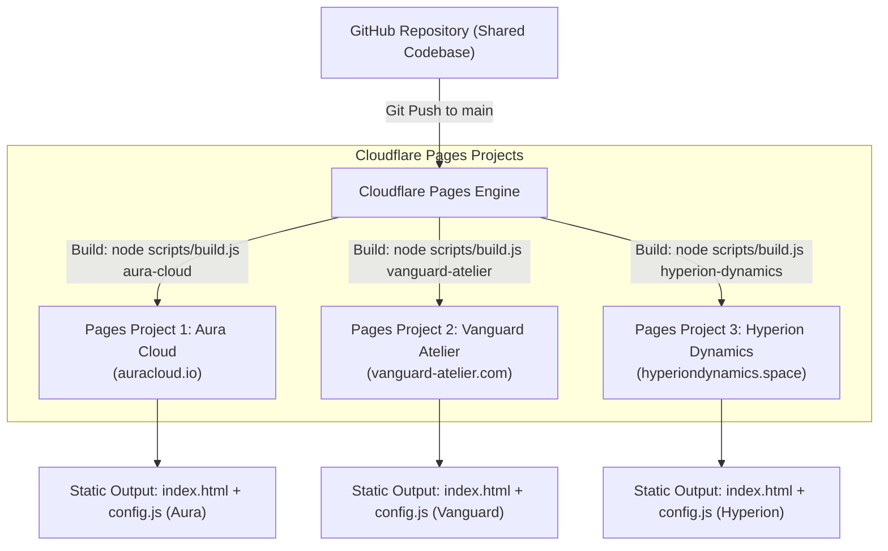

# Multi-Brand Cloudflare Pages Deployment & Production Architecture

This guide details how to deploy multiple independent brand websites from the **SAME** GitHub repository and shared codebase to **Cloudflare Pages** without duplicating UI code or rewriting the application.

---

## 🏗️ Architecture Overview



### Key Architectural Advantages:
1. **Single Repository**: Core components, countdown logic, styling presets, and bug fixes are maintained in one place.
2. **Zero Code Duplication**: Adding a new brand requires creating a single file in `configs/`—no HTML/CSS/JS duplication.
3. **Completely Isolated Deployments**: Each Cloudflare Pages project runs in its own isolated build container. A build for Brand A does not affect or leak into Brand B.
4. **No Environment Variables or Secrets Needed for Brand Selection**: The brand is passed as a command-line argument to the lightweight selector script (`node scripts/build.js <brand-id>`).

---

## 📁 Recommended GitHub Repository Structure

```
├── configs/                     # Dedicated directory for all brand configurations
│   ├── template.js              # Clean starter template with documentation
│   ├── aura-cloud.js            # Configuration for Aura Cloud
│   ├── vanguard-atelier.js      # Configuration for Vanguard Atelier
│   └── hyperion-dynamics.js     # Configuration for Hyperion Dynamics
├── scripts/
│   └── build.js                 # Configuration selector & validation build script
├── src/                         # Reusable application components and logic
│   ├── app.js                   # Application coordinator & controller
│   ├── config-validator.js      # Runtime schema validator
│   ├── countdown.js             # Pure logic timezone-safe countdown engine
│   ├── theme.js                 # CSS custom property token manager
│   └── components/              # Modular UI components
├── tests/                       # Automated test suites
│   ├── countdown.test.mjs       # Countdown math and timezone tests
│   ├── config-validator.test.mjs# Schema validation tests
│   └── build-script.test.mjs    # Build selector & security tests
├── config.js                    # Active configuration entry point (generated at build)
├── index.html                   # Semantic HTML5 entry container
├── styles.css                   # Responsive styles, layout presets, dark/light themes
├── package.json                 # Project scripts and metadata
├── CONFIG_REFERENCE.md          # Comprehensive schema reference
└── DEPLOYMENT_GUIDE.md          # This deployment guide
```

---

## ⚡ How to Add a New Brand in 4 Steps

### Step 1: Create the Brand Configuration File
Duplicate `configs/template.js` to `configs/<your-brand-id>.js`.
The filename (minus `.js`) becomes your **Brand Identifier** (e.g. `configs/solaris-energy.js` -> identifier: `solaris-energy`).

```bash
cp configs/template.js configs/solaris-energy.js
```

### Step 2: Customize Brand Details & Launch Clock
Edit `configs/solaris-energy.js`:
- Set `brand.name`, `brand.domain`, `brand.tagline`, `brand.badge`.
- Select `theme.preset` (`'centered-minimalist'`, `'split-screen'`, or `'elegant-gradient'`).
- Choose `theme.mode` (`'dark'`, `'light'`, or `'auto'`).
- **Set an authoritative launch timestamp** (see [Countdown Timestamp Safety](#-countdown-timestamp-safety) below).
- Set `content.headline` and `content.subheadline`.
- Configure optional CTAs, social channels, and email webhook.

### Step 3: Test and Validate Locally
Run the validation and build tests:
```bash
# Test build selector for the new brand
node scripts/build.js solaris-energy

# Run full automated test suites
npm test
```

### Step 4: Create Cloudflare Pages Project
1. Go to **Cloudflare Dashboard** > **Workers & Pages** > **Create application** > **Pages** > **Connect to Git**.
2. Select your repository.
3. Configure the build settings (see table below).
4. Click **Save and Deploy**.

---

## ⚙️ Cloudflare Pages Exact Project Settings

Configure each brand as a separate Cloudflare Pages project pointing to the **same repository** and **main** branch:

| Project Name | Custom Domain | Framework Preset | Build Command | Build Output Directory | Root Directory |
| :--- | :--- | :--- | :--- | :--- | :--- |
| `aura-cloud-prelaunch` | `auracloud.io` | **None** | `node scripts/build.js aura-cloud` | `.` (or `/`) | *(leave empty / root)* |
| `vanguard-atelier-prelaunch` | `vanguard-atelier.com` | **None** | `node scripts/build.js vanguard-atelier` | `.` (or `/`) | *(leave empty / root)* |
| `hyperion-dynamics-prelaunch` | `hyperiondynamics.space` | **None** | `node scripts/build.js hyperion-dynamics` | `.` (or `/`) | *(leave empty / root)* |
| `your-new-brand` | `yourdomain.com` | **None** | `node scripts/build.js your-brand-id` | `.` (or `/`) | *(leave empty / root)* |

> [!NOTE]
> **Build Output Directory**: Set to `.` (dot) or `/` (slash). The application is lightweight and serves static files (`index.html`, `styles.css`, `src/`, `config.js`) directly from the repository root.

---

## 🔄 How Shared Git Commits Propagate to Multiple Pages Projects

When you push a new commit to GitHub (e.g. updating a component in `src/` or adding a new brand in `configs/`):

1. **Automatic Webhook Trigger**: GitHub sends a push webhook event to Cloudflare Pages.
2. **Parallel Isolated Builds**: Cloudflare Pages automatically spins up concurrent, isolated build runners for **every** Pages project connected to that branch.
3. **Execution**:
   - Runner 1 executes `node scripts/build.js aura-cloud`, validates `configs/aura-cloud.js`, copies it to `config.js`, and deploys the Aura Cloud site.
   - Runner 2 executes `node scripts/build.js vanguard-atelier`, validates `configs/vanguard-atelier.js`, copies it to `config.js`, and deploys the Vanguard Atelier site.
   - Runner 3 executes `node scripts/build.js hyperion-dynamics`, validates `configs/hyperion-dynamics.js`, copies it to `config.js`, and deploys the Hyperion Dynamics site.
4. **Instant Zero-Downtime Deployment**: Each site updates simultaneously with the latest core code while retaining its distinct brand identity and countdown timer.

---

## ⏱️ Countdown Timestamp Safety

To ensure reliable, professional prelaunch countdowns that never reset or drift:

### 1. Always Use Explicit ISO 8601 Strings with Timezones
In each `configs/<brand-id>.js`, configure `launch.launchAt` with an explicit timezone offset or UTC (`Z`):
- `2026-11-15T18:00:00+01:00` (Central European Time)
- `2026-12-01T14:30:00Z` (UTC / Zulu)
- `2026-10-31T09:00:00-04:00` (US Eastern Daylight Time)

### 2. Why Future Git Pushes Cannot Restart the Countdown
Because each brand configuration stores an **absolute target timestamp** rather than a relative duration, subsequent Git pushes, deployments, page refreshes, and visitor tab switches will **never** reset the timer. Every visitor's browser computes:
$$\text{remainingMs} = \max(0, \text{launchTimestampEpoch} - \text{currentEpoch})$$

### 3. Expiration Freeze
When the countdown hits `00:00:00:00`, the site automatically transitions to the live state defined in `launch.onLaunch`. The timer permanently stops and will not restart.

---

## 🔒 Security & Secrets Policy

> [!WARNING]
> **ALL CONFIGURATION FILES IN `configs/` AND `config.js` ARE PUBLIC ASSETS.**
> These files are shipped directly to client web browsers.
> 
> **NEVER** store:
> - Private API keys or secret tokens
> - Database connection strings or passwords
> - Private authentication credentials
> 
> **Safe to include**:
> - Public brand names, domains, copy, and layout settings
> - Public social profile URLs and mailto addresses
> - Public form endpoints (e.g. Formspree public form IDs, public webhook URLs designed for browser submissions)

---

## 🛠️ Local Testing & Troubleshooting

### Available NPM Scripts:
```bash
# List all available brand configs
npm run list-configs

# Test build specific brands locally
npm run build:aura
npm run build:vanguard
npm run build:hyperion

# Run all automated test suites
npm test
```

### Troubleshooting Common Build Issues:

| Symptom | Cause | Solution |
| :--- | :--- | :--- |
| `ERROR: Invalid brand identifier` | Identifier contains illegal characters or path traversal (e.g. `../` or spaces). | Use only alphanumeric characters, hyphens, and underscores (e.g. `solar-brand`). |
| `ERROR: Configuration file not found` | No corresponding `.js` file in `configs/`. | Ensure `configs/<brand-id>.js` exists and is committed to Git. |
| `ERROR: Configuration validation failed` | Missing required fields like `brand.name` or invalid ISO date string. | Run `npm test` locally to inspect the detailed validation errors. |
